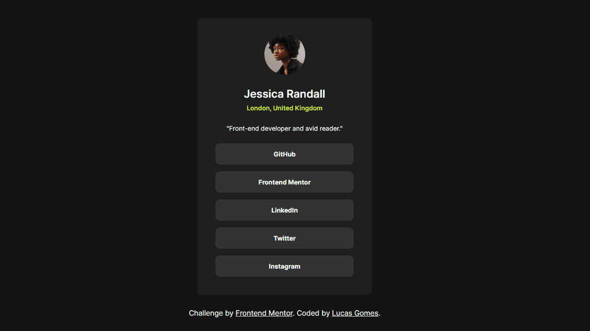

# Solução do desafio: Frontend Mentor Social links profiles
Desafio realizado pelo site Frontend Mentor. 

O projeto trata-se de um card com links das redes sociais de uma pessoa, ao interagir com os botões somos redirecionados ao seu perfil em cada uma dessas redes.

## ⚙ Tecnologias utilizadas
- HTML
- CSS (Flexbox)